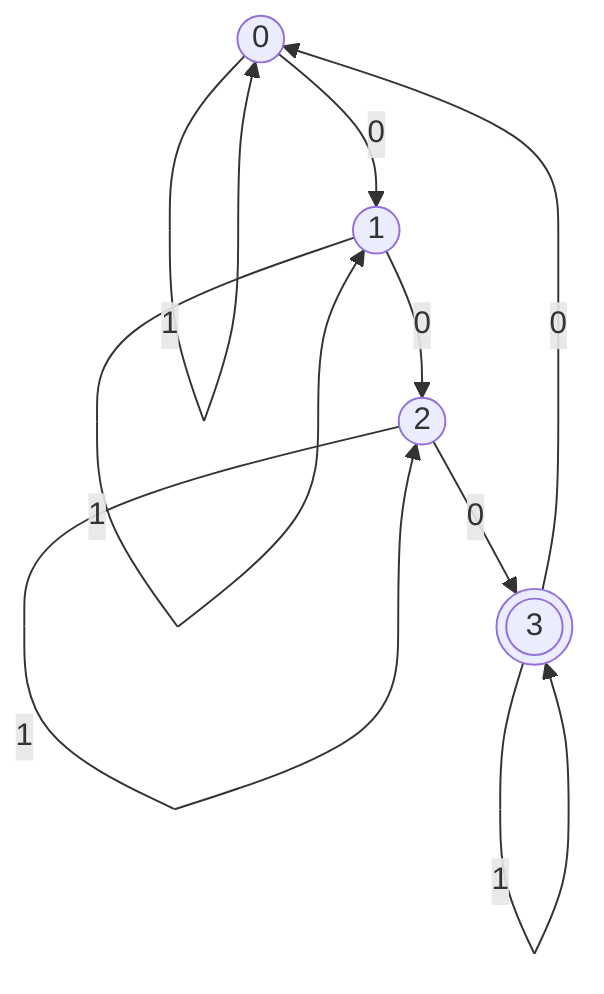

# Lernen

> a simple automata learning library.

## Usage

```ruby
require "lernen"

automaton = Lernen.learn(alphabet: %w[0 1]) do |inputs|
  inputs.count("0") % 4 == 3
end

puts automaton.to_mermaid
# => flowchart TD
#      0((0))
#      1((1))
#      2((2))
#      3(((3)))
#    
#      0 -- 0 --> 1
#      0 -- 1 --> 0
#      1 -- 0 --> 2
#      1 -- 1 --> 1
#      2 -- 0 --> 3
#      2 -- 1 --> 2
#      3 -- 0 --> 0
#      3 -- 1 --> 3
```



## Algorithms

Learnen supports these automata learning algorithms.

| Algorithm        | Supported `automaton_type` |
|:----------------:|:--------------------------:|
| `LStar`          | `:dfa`, `:moore`, `:mealy` |
| `KearnsVazirani` | `:dfa`, `:moore`, `:mealy` |
| `LSharp`         | `:dfa`, `:moore`, `:mealy` |

## License

[MIT](https://opensource.org/license/MIT)

2024 (C) Hiroya Fujinami
