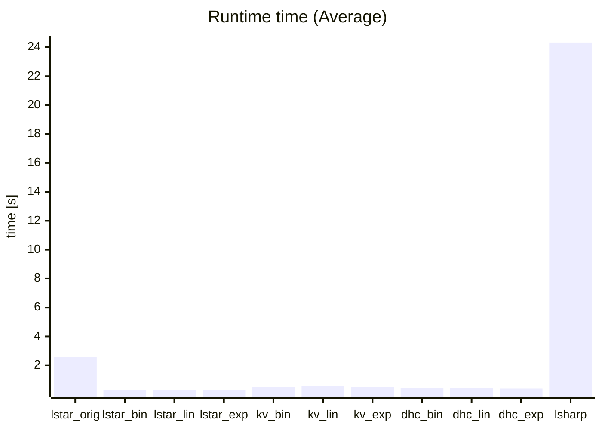
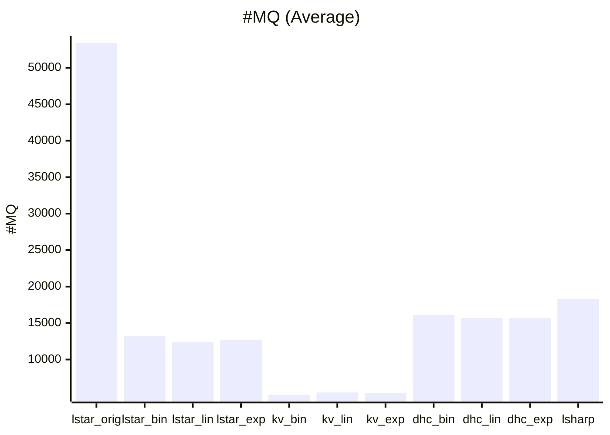
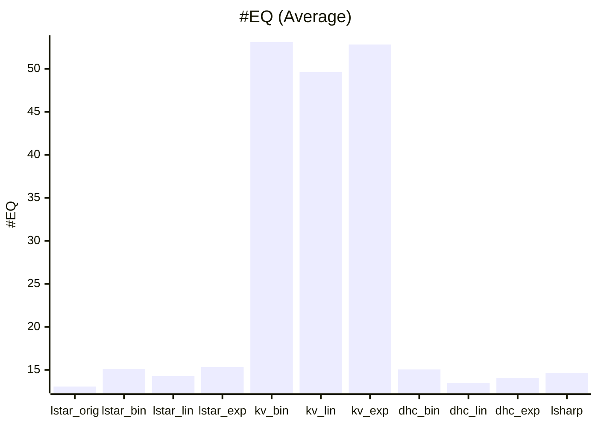

# Experiments

To compare the performance of each alogorithm implemented in Lernen, we conduct experiments.
In this experiment, 100 automata with 100 to 200 states on 3-symbols alphabet are randomly generated and learned on each algorithm with the `random_word` oracle.
The experiments were performed on a MacBook Pro (Apple M1 Max / 64GB) at 2024/12/06.

## Results

**Table 1**: A comparison table of the experiments
 
|            | #OK |Runtime time [s] (avg/min/mid/max) | #MQ (avg/min/mid/max)         | #EQ (avg/min/mid/max)  |
|:----------:|----:|:----------------------------------|:------------------------------|:-----------------------|
| lstar_orig | 100 |              2.57/0.29/5.75/11.72 |     53397/11357/107655/149212 |             13/5/22/22 |
| lstar_bin  |  99 |               0.29/0.16/0.43/0.56 |        13204/4575/18030/30235 |             15/7/20/30 |
| lstar_lin  |  99 |               0.31/0.16/0.46/0.69 |        12376/4929/18003/28947 |             14/4/18/30 |
| lstar_exp  |  99 |               0.28/0.16/0.31/0.54 |        12723/4865/16359/29348 |             15/4/19/29 |
| kv_bin     |  99 |               0.53/0.23/0.68/1.33 |          5169/2416/5844/10593 |            53/29/65/80 |
| kv_lin     |  99 |               0.58/0.25/1.13/1.34 |           5484/2869/8331/9338 |            49/24/45/75 |
| kv_exp     |  99 |               0.53/0.22/0.69/1.18 |          5413/2547/7811/11182 |            52/27/66/84 |
| dhc_bin    | 100 |               0.42/0.17/0.56/0.87 |        16111/4728/23750/34199 |             15/3/11/35 |
| dhc_lin    | 100 |               0.43/0.14/0.89/1.93 |        15685/4472/37116/39737 |             13/4/22/27 |
| dhc_exp    | 100 |                0.4/0.16/0.84/0.94 |        15669/5478/29118/35841 |             14/4/26/34 |
| lsharp     |  99 |           24.33/4.24/35.79/107.27 |        18308/6891/21025/47069 |             14/5/23/27 |

Where #OK is the number of correctly learned, runtime time is the learning runtime time, #MQ is the number of MQ (membership query) calls, and #EQ is the number of EQ (equivalent query) calls.

**Figure 1**: A chart of runtime times

**Figure 2**: A chart of #MQs

**Figure 3**: A chart of #EQs

